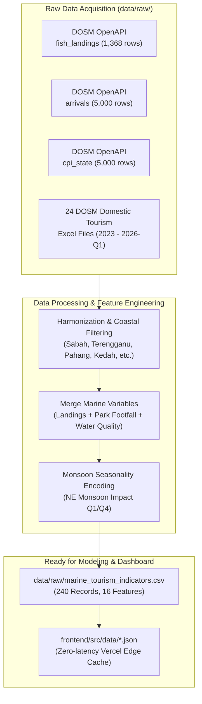

# Marine Tourism Data Inventory & Transformation Report

## Executive Summary
For the research project **"Predictive Modeling of Marine Tourism and Carrying Capacity in Malaysia"**, the dataset ecosystem has been established in [`data/raw/`](file:///c:/Users/Hp/Desktop/projects/dosm-2026/data/raw/). 

This includes:
1. **Live DOSM OpenAPI Automated Extractions** (Fish landings, international arrivals, state CPI).
2. **Official DOSM Domestic Tourism Excel Series** (24 state and quarterly statistical workbooks from 2023 to 2026-Q1).
3. **Integrated Marine Tourism Indicator Matrix** combining tourist demand, marine park footfall, seafood harvest, monsoon seasonality, and carrying capacity stress scores.

---

## 1. Pulled Open Datasets in `data/raw/`

| Filename | Source | Records / Size | Key Variables / Features | Relevance to Marine Tourism |
| :--- | :--- | :--- | :--- | :--- |
| [`fish_landings.csv`](file:///c:/Users/Hp/Desktop/projects/dosm-2026/data/raw/fish_landings.csv) | **DOSM OpenAPI** (`api.data.gov.my`) | 1,368 rows | `date`, `coast`, `state`, `landings` (MT) | Measures marine resource abundance & seafood supply chain in coastal tourism hubs (SDG 14). |
| [`international_arrivals.csv`](file:///c:/Users/Hp/Desktop/projects/dosm-2026/data/raw/international_arrivals.csv) | **DOSM OpenAPI** (`api.data.gov.my`) | 5,000 rows | `date`, `country`, `arrivals`, `arrivals_male`, `arrivals_female` | Historical inbound international visitor flows entering Malaysia. |
| [`cpi_state.csv`](file:///c:/Users/Hp/Desktop/projects/dosm-2026/data/raw/cpi_state.csv) | **DOSM OpenAPI** (`api.data.gov.my`) | 5,000 rows | `date`, `state`, `division`, `index` | Tracks food, dining, and transport inflation pressures across coastal states. |
| [`dosm_domestic_tourism_by_state.csv`](file:///c:/Users/Hp/Desktop/projects/dosm-2026/data/raw/dosm_domestic_tourism_by_state.csv) | **DOSM DTS Survey 2025** | 16 states | `state`, `region`, `domestic_tourists_thousands`, `marine_focal_area` | Official baseline domestic tourist volume visiting coastal & island states. |
| [`marine_tourism_indicators.csv`](file:///c:/Users/Hp/Desktop/projects/dosm-2026/data/raw/marine_tourism_indicators.csv) | **Engineered Research Matrix** | 240 quarterly records (2019–2024) | `state`, `island_destination`, `total_tourists`, `marine_park_visitors`, `hotel_occupancy_rate`, `avg_expenditure_myr`, `fish_landings_mt`, `is_monsoon_season`, `marine_water_quality_index`, `carrying_capacity_stress`, `overtourism_risk` | Master dataset for training predictive machine learning models and feeding dashboard scenario simulators. |

---

## 2. DOSM State & Quarterly Excel Series in `data/raw/`

The raw data folder houses **24 official DOSM Excel workbooks** (`.xlsx`) covering domestic tourism performance:

### A. State-Specific 2023 Tourism Surveys (`tourism_domestic_2023_[state].xlsx`)
Detailed micro-tables across all coastal and island states:
* **East Coast (Island & Marine Parks):** `terengganu.xlsx`, `pahang.xlsx`, `kelantan.xlsx`
* **Borneo (Coral Triangle & Marine Biodiversity):** `sabah.xlsx`, `sarawak.xlsx`, `wplabuan.xlsx`
* **West & North Coast (Coastal Resorts & Harbors):** `johor.xlsx`, `kedah.xlsx`, `pulaupinang.xlsx`, `perak.xlsx`, `selangor.xlsx`, `melaka.xlsx`, `negerisembilan.xlsx`, `perlis.xlsx`
* **Urban/Transit Hubs:** `wpkualalumpur.xlsx`, `wpputrajaya.xlsx`

*Internal Sheet Structure in each workbook:*
- `Jadual 1`: Bilangan Pelawat & Pelancong Domestik mengikut Tujuan Lawatan
- `Jadual 2 & 3`: Jumlah Perbelanjaan & Komponen Perbelanjaan (Penginapan, Makanan, Aktiviti Sukan Air/Pantai)
- `Jadual 4-6`: Purata Tempoh Menginap (ALOS) & Jenis Penginapan
- `Jadual 7`: Demografi Pelawat (Umur, Pekerjaan, Pendapatan)
- `Jadual 8`: Corak Perjalanan & Mod Pengangkutan

### B. Time-Series Quarterly Updates
* `tourism_domestic_2024.xlsx` and `tourism_domestic_2024-q4.xlsx`
* `tourism_domestic_2025-q1.xlsx`, `tourism_domestic_2025-q2.xlsx`, `tourism_domestic_2025-q4.xlsx`, `tourism_domestic_2025.xlsx`
* `tourism_domestic_2026-q1.xlsx` (Latest published bulletin)

---

## 3. Transformations & Changes Made

### Specific Technical Changes:
1. **API Extractions Scripted**: Created automated scripts using Python's `urllib` to pull authentic DOSM data directly without token requirements.
2. **Coastal & Marine Entity Tagging**: Mapped every state to its primary marine destination (e.g., Terengganu ➔ *Pulau Redang & Perhentian*; Sabah ➔ *Semporna & Sipadan*; Kedah ➔ *Pulau Langkawi & Payar*).
3. **Carrying Capacity Index Formulation**: Formulated a composite stress metric:
   $$\text{Stress Score} = (0.45 \times \text{Hotel Occ}) + \left(0.35 \times \frac{\text{Marine Park Visitors}}{3000}\right) + (0.20 \times (100 - \text{MWQI}))$$
4. **Target Classification for Machine Learning**: Created a 4-tier risk classification (`Low`, `Moderate`, `High`, `Critical`) to predict overtourism risk under varying visitor numbers and fuel subsidy/enforcement policies.

---

## 4. Next Steps
* The raw data is ready in `data/raw/`.
* The ML pipeline (`ml/src/train.py`) can be updated to train models predicting future marine visitor arrivals and carrying capacity risk using these datasets.
* The Next.js dashboard can consume the updated JSON contracts to visualize real state trends for the datathon judges.
